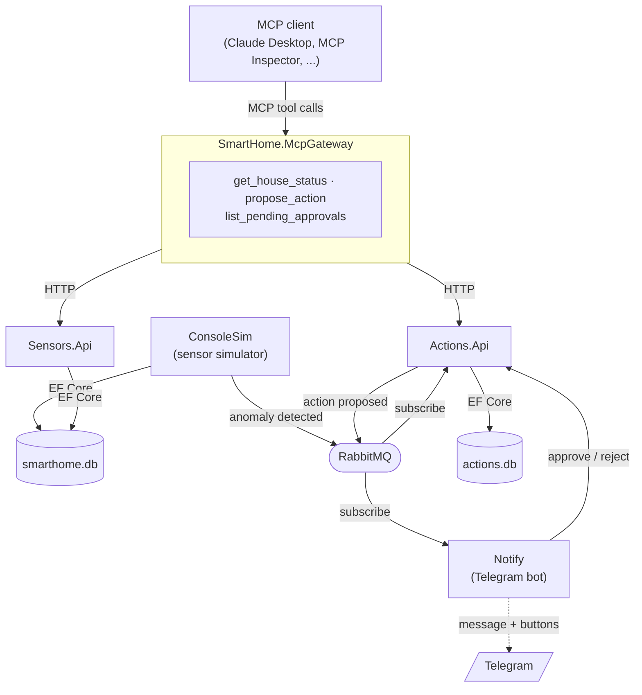

# SmartHome AI-Ops


[](LICENSE)

A .NET microservices backend for a simulated smart home, fronted by its own **MCP server** —
built around C#, ASP.NET Core, Clean Architecture, CQRS, async messaging between services, and
the [Model Context Protocol (MCP)](https://github.com/modelcontextprotocol/csharp-sdk) C# SDK.

## The idea

**MCP** is a standard that lets AI assistants plug into external systems and use them like
tools — think of it like a USB port: any MCP-speaking client (Claude Desktop, the official MCP
Inspector, or others) can plug into an MCP server and ask it things, with no custom integration
code needed per client.

This project builds a small "nervous system" of .NET microservices for a fake house, then puts
an MCP server in front of it. Once it's running, an MCP client can:

- ask what's currently going on in the house (a **query** — latest reading per sensor, and
  whether anything's running hot)
- propose an action (e.g. "turn off the office heater, it's been on for 6 hours") — which the
  backend stores as a **pending approval** rather than acting on immediately
- get that approval pushed to a real human over Telegram, with inline Approve/Reject buttons

That last point — human-in-the-loop approval before anything "real" happens — mirrors a
production pattern used for anything risky (payments, infrastructure changes, and so on),
independent of the AI angle entirely: a good backend never lets a caller, AI or otherwise,
silently take real-world actions without a check.

No agent framework to install or host — this repo *is* the MCP server, and any existing MCP
client can plug straight into it.

## Architecture



Each service is a self-contained microservice with its own `Domain` / `Application` /
`Infrastructure` / `Api` layers and its own SQLite database — Clean Architecture applied per
service rather than once for the whole system. The MCP gateway is deliberately thin: it
translates tool calls into plain HTTP calls against the other services, with no business logic
duplicated there.

## Project structure

```
src/
├── SmartHome.Domain                 # Sensor / SensorReading / SensorType — no dependencies
├── SmartHome.Infrastructure         # EF Core + SQLite for the Sensors data
├── SmartHome.Application            # CQRS queries for the Sensors Api (MediatR + FluentValidation)
├── SmartHome.ConsoleSim             # Async sensor simulator; publishes anomaly events
├── SmartHome.Sensors.Api            # GET /sensors, /status, /sensors/{id}/readings
│
├── SmartHome.Actions.Domain         # ProposedAction — its own approve/reject rules
├── SmartHome.Actions.Infrastructure # EF Core + SQLite for the Actions data
├── SmartHome.Actions.Application    # Propose/Approve/Reject commands + pending-approvals query
├── SmartHome.Actions.Api            # The approval workflow; publishes "action proposed" events
│
├── SmartHome.Notify                 # Telegram bot: pushes approvals, relays button taps back
└── SmartHome.McpGateway             # Exposes the whole system as MCP tools
```

## Highlights

- **Clean Architecture + CQRS**, applied independently across multiple services rather than
  once for a single app
- **Async messaging** between services via RabbitMQ — a sensor anomaly and an approval request
  both flow as real pub/sub events, not direct calls
- **A working MCP server** built on the official C# SDK, exposing real tools backed by real
  services
- **A safety-conscious design**: proposed actions sit as pending approvals until a human
  decides, surfaced through a real Telegram bot with inline buttons
- **Independent data per service** — each microservice owns its own SQLite database; nothing
  reaches across a service boundary to another service's tables

See [`ROADMAP.md`](ROADMAP.md) for what's next — observability (Prometheus + Grafana) and
final polish are still ahead.

## Tech stack

- **C# / .NET 8** — every service and the simulator
- **ASP.NET Core** (minimal APIs) — the Sensors, Actions, and MCP gateway APIs
- **EF Core + SQLite** — one database per service
- **MediatR + FluentValidation** — CQRS inside each service
- **RabbitMQ** — async messaging between services
- **Telegram Bot API** (`Telegram.Bot`) — real approve/reject notifications
- **ModelContextProtocol.AspNetCore** (official MCP C# SDK) — the MCP gateway
- **Docker Compose** — runs RabbitMQ (Prometheus/Grafana join it in a later phase)

## Running it locally

```bash
# 1. Start the message broker
docker compose up -d rabbitmq

# 2. Run the simulator (generates readings, detects anomalies)
cd src/SmartHome.ConsoleSim && dotnet run

# 3. Run the services, each in its own terminal
cd src/SmartHome.Sensors.Api && dotnet run   # http://localhost:5152
cd src/SmartHome.Actions.Api && dotnet run   # http://localhost:5073
cd src/SmartHome.McpGateway  && dotnet run   # http://localhost:5041

# 4. (optional) Run Notify for real Telegram approvals — needs a bot token from
#    @BotFather, stored via `dotnet user-secrets`, never committed
cd src/SmartHome.Notify && dotnet run
```

Then point an MCP client at `http://localhost:5041/` — either the
[MCP Inspector](https://github.com/modelcontextprotocol/inspector) for poking at tools directly,
or a real client like Claude Desktop for an actual conversation about the house.

## Status

🚧 Active development — Phases 1 through 7 (domain modeling → persistence → a Web API →
Clean Architecture/CQRS → microservices + MCP) are built and working end to end. Observability
and final polish are still ahead. See [`ROADMAP.md`](ROADMAP.md) for the phase-by-phase plan
and [`docs/PROGRESS.md`](docs/PROGRESS.md) for the running build log.
